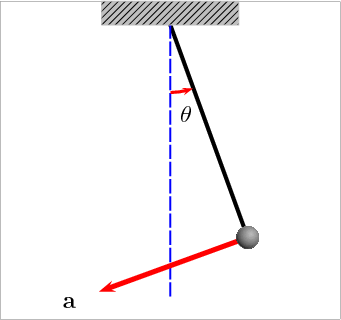

# Mathematical pendulum using the Runge Kutta method
This is the documentation for the repository of the homework 4 Mathematical_pendulum_using_the_Runge_Kutta_method.jl of the Numerical Methods course. The documentation is divided into two parts. The first part provides a mathematical explanation of the pendulum and the Runge-Kutta method. The second part provides a technical explanation of the code we used to solve the given problem.

## The mathematical explanation
### Introduction 
The point of the task is to develop a Numerical method for solving the mathematical pendulum problem. We have to construct a function 'nihalo' that will compute the displacement of the pendulum for a specific time. For this we will convert the second-order differential equation into a system of first-order equations and solve it using the fourth-order Runge-Kutta method.

)&plus;\theta''(t)=0,\theta(0)=\theta_0,\theta'(0)=\theta'_0)

At the end will also compered the whit a oscillating pendulum and a harmonic pendulum. 

### Mathematical pendulum and  Harmonic pendulum
The mathematical pendulum is a pendulum that is not affected by friction. On the image below, you can see the mathematical pendulum. Unlike the harmonic pendulum's sinusoidal motion, the oscillation period of a mathematical pendulum relies on initial conditions or energy.

<p align="center">
  
</p>

### Runge-Kutta method
The Runge-Kutta methods are a group of iterative methods used to solve ordinary differential equations (ODEs) and differential algebraic equations (DAEs).

## The code explained and results

First we initials the variables 
```julia    
g = 9.80665 # gravitational acceleration for Earth

l = 1 # length of the pendulum
t = 10 # time
n = 1000 # number of time steps
theta0 = deg2rad(30) # initial angle
dtheta0 = deg2rad(1) # initial angular velocity
```
Then we define the function 'nihalo' that will compute the displacement of the pendulum for a specific time. For this we will convert the second-order differential equation into a system of first-order equations and solve it using the fourth-order Runge-Kutta method.
```julia
function nihalo(l, t, theta0, dtheta0, n,g)
    h = t / n  # step size

    y = [theta0, dtheta0]  # initial conditions
    theta_vals = [theta0]  # store the solution here

    for _ in 1:n-1  # loop over time steps
        k1 = h .* derivatives(y, l, g)
        k2 = h .* derivatives(y + 0.5 .* k1, l, g)
        k3 = h .* derivatives(y + 0.5 .* k2, l, g )
        k4 = h .* derivatives(y + k3, l,g)
        y += (k1 + 2 .* k2 + 2 .* k3 + k4) / 6.0
        push!(theta_vals, y[1])
    end 
    
    return theta_vals

end
```
The we plot the results for the mathematical pendulum
```julia
plot(t_vals, theta_vals, label="Mathematical pendulum", xlabel="Time [s]", ylabel="Displacement [rad]")
```
the resulting graf is: 


Then we define the function 'harmonic' that will compute the displacement of the harmonic pendulum for a specific time.
```julia
function harmonic_oscillator(l, t, theta0, dtheta0,g)
    return theta0 * cos(sqrt(g/l) * t) + dtheta0/sqrt(g/l) * sin(sqrt(g/l) * t)
end
```
The we plot the results for the harmonic pendulum
```julia
plot(t_vals, harmonic_oscillator.(l, t_vals, theta0, dtheta0,g), label="Harmonic oscillator", xlabel="Time [s]", ylabel="Displacement [rad]")
```
the resulting graf is:  


Then we define the function 'period' that will compute the period of the pendulum for a specific energy.
```julia
function period(l, t, theta0, dtheta0, n,g)
    theta = nihalo(l, t, theta0, dtheta0, n, g)
    h = t / n  # time step
    t_half_period = argmin(abs.(theta .- theta0)) * h
    return 2 * t_half_period
end

function find_period(displacement, h)
    peaks = findall(diff(sign.(diff(displacement))) .< 0)
    return peaks[2] * h - peaks[1] * h
end

function energy(l, theta, dtheta,g)
    return 0.5 * l^2 * dtheta^2 + g * l * (1 - cos(theta))
end
```
The we plot the results for the period of the pendulum as a function of energy
```julia
plot(energy.(l, theta_vals, dtheta_vals,g), period.(l, t, theta_vals, dtheta_vals, n,g), label="Period of a Pendulum as a Function of Energy", xlabel="Energy [J]", ylabel="Period [s]")
```
the resulting graf is:


## Conclusion
I think the method I used is good for solving the mathematical pendulum problem. The results are similar to the results of the harmonic pendulum. 
As for the the energy of the pendulum, the results are as expected I think. The higher the energy, the longer the period of the pendulum.

docs\src